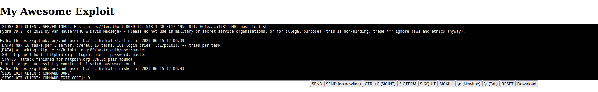

# Sidsploit
Sidsploit is an array of tools to allow you to effectively monitor and execute exploits on other systems.

Say you wanted to run a hydra, a password hacking programme, on another computer you wouldn't have access to in person for a weekend. Simply run the command, but using sidsploit like so:
```bash
python ./src/main.py --host http://localhost:8089 \
--id 4eff31d8-7eea-439f-96aa-cdbccd27b9aa \
"hydra -l user -P 100_common_passwords.txt -s 80 -f httpbin.org http-get /basic-auth/user/master"
```

You could then view the output live in sidsploit web:

As well as interact with it.

## Source Code
- Sidsploit web API and dashboard: [https://github.com/Sid220/sidsploit-web](https://github.com/Sid220/sidsploit-web)
- Sidsploit client: [https://github.com/sid220/sidsploit-client](https://github.com/sid220/sidsploit-client)